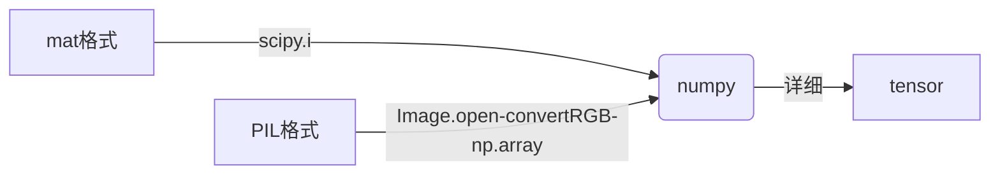

#### 1. 输入的问题

- 类型转换



- numpy转tensor
  - 图片需要通道转换：np.transpose
  - 转换后可以使用transform.ToTensor(自动归一化), transform.randomcrop
  - 最后转tensor：torch.from_numpy

- 对于输入输出都是图片的训练：用dict存input和label
- transforms.compose([])：也可以用自己的类（因为dict要先拆开才能用transform）

```python
class ToTensor(object):
    """Convert ndarrays in sample to Tensors."""
    '''复写__call__方法，就可以传入compose'''
    def __call__(self, sample):
        # if sample.keys
        image, label = sample['image'], sample['label']
        tran = transforms.ToTensor()
        return {'image': tran(image),
                'label': tran(label)}
```

- Datasets
  - 重写getitem()
- trainloader
- 归一化

#### 2. 模型训练超参数

- weight decay与lr

  >weight decay（权值衰减）使用的目的是防止过拟合。
  >
  >在损失函数中，weight decay是放在正则项（regularization）前面的一个系数，正则项一般指示模型的复杂度，所以weight decay的作用是调节模型复杂度对损失函数的影响，若weight decay很大，则复杂的模型损失函数的值也就大。
  >
  >momentum是梯度下降法中一种常用的加速技术。

  weight decay太大，模型训练不了。

- 注意把存储路径，模型超参数统一放到一个类作为属性封装，不然训练的时候会出各种问题

#### 3. 模型评估（[PSNR文档](https://scikit-image.org/docs/stable/api/skimage.metrics.html#skimage.metrics.peak_signal_noise_ratio)，[SSIM 文档][https://scikit-image.org/docs/stable/api/skimage.metrics.html#skimage.metrics.structural_similarity]）

- 导入：

```python
from skimage.metrics import structural_similarity as ssim
from skimage.metrics import peak_signal_noise_ratio as psnr
```

- 使用注意：

  - 1. 多通道PSNR(db)计算

  > 如果是彩色图像，通常有三种方法来计算。
  >
  > 1. 分别计算 RGB 三个通道的 PSNR，然后取平均值。
  > 2. 计算 RGB 三通道的 MSE ，然后再除以 3 。
  > 3. 将图片转化为 YCbCr 格式，然后只计算 Y 分量也就是亮度分量的 PSNR
  >
  > PSNR（峰值信噪比）：用得最多，但是其值不能很好地反映人眼主观感受。一般取值范围：20-40.值越大，视频质量越好。
  >
  > SSIM（结构相似性）：计算稍复杂，其值可以较好地反映人眼主观感受。一般取值范围：0-1.值越大，视频质量越好。

  - ssim一张一张算，求平均要自己写函数
  - psnr可以几十张图片一起计算?

#### 4. 遗留问题

1. 是否需要把加载到GPU上的输入tensor再移出来腾地方？
2. 如何实现在训练200次以后让weight decay变为0.5
3. 归一化：模型输出的像素值就是0-1之间，且最大值不是1，最小值不是0。这个时候应该不做归一化
4. 实现DE_UNet时没有加Pixel-shuffle层（维度不对）
5. 我的PSNR和SSIM计算到底正确不？

